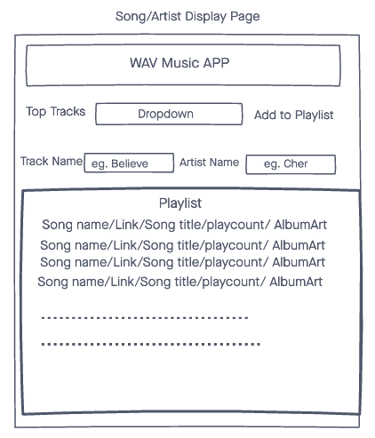
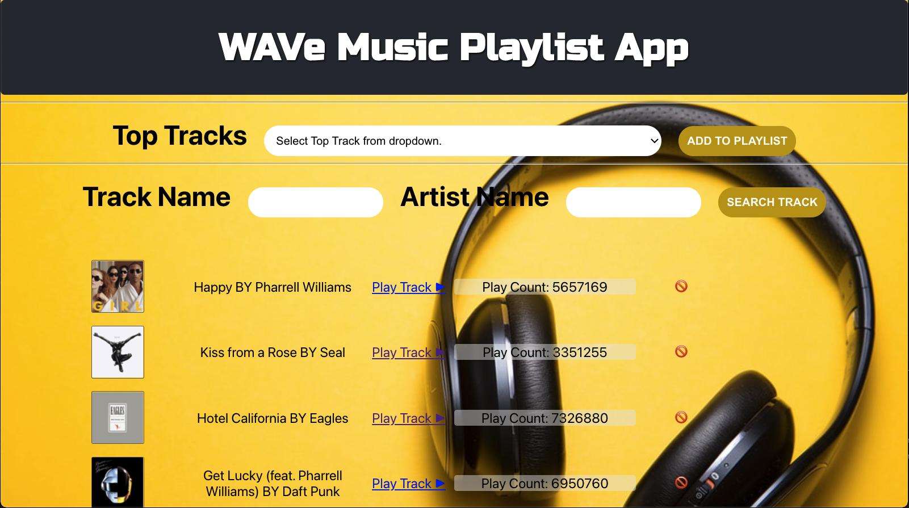

# WAVe Music Playlist App.

1. A simple Music PLAYLIST APP.
2. Allows you to create a playlist of your favorite songs.
3. Select top tracks from dropdown at the top of page to add to playlist.
4. You can enter Artist and song information in feilds to search for your favorite tracks.
5. "Play track" text takes you to a last FM page to be able to play song.
7. There is a delete button to independently delete each song added.

##  Getting Started. 🏎💨 

[click here](https://react-wave-app.herokuapp.com/) to get started. 

##  Technologies Used. ⚙️
- CSS
- Express
- MongoDB
- Mongoose
- Morgan
- CORS
- Github
- Last FM API
- Heroku for deployment.

##  Screenshots and Wireframes. 📸    

##  Future Enhancements. 🛠

- Add Authentication.
- Minor UI tweeks.
- Possible Animations.
- Add Update Feature.
- Add ability play Tracks directly from app.
